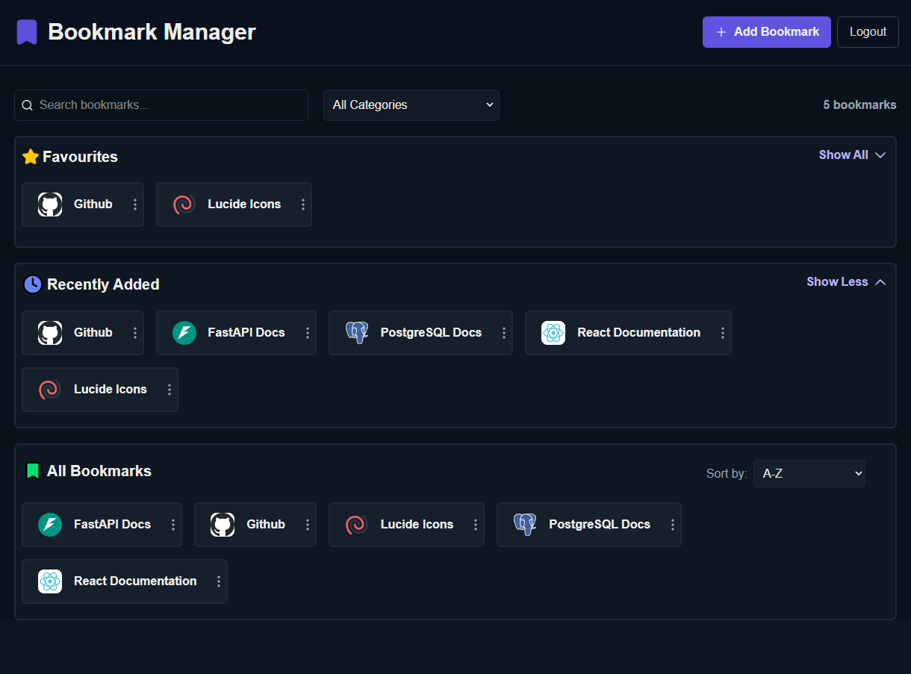
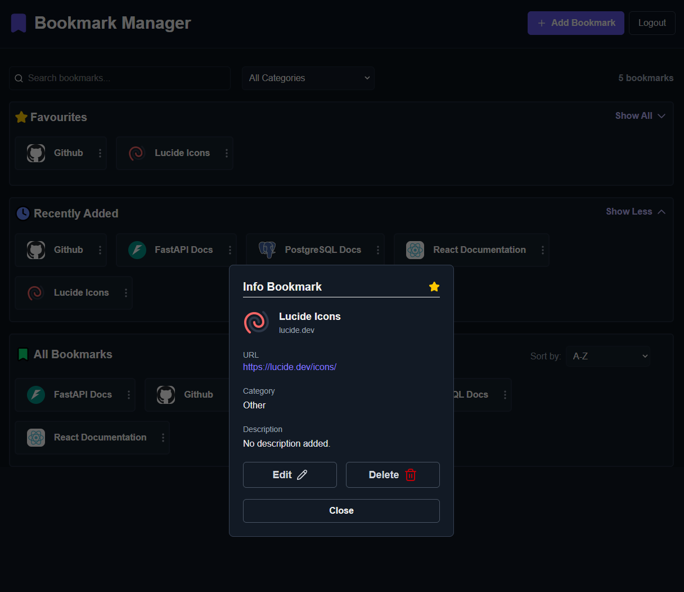
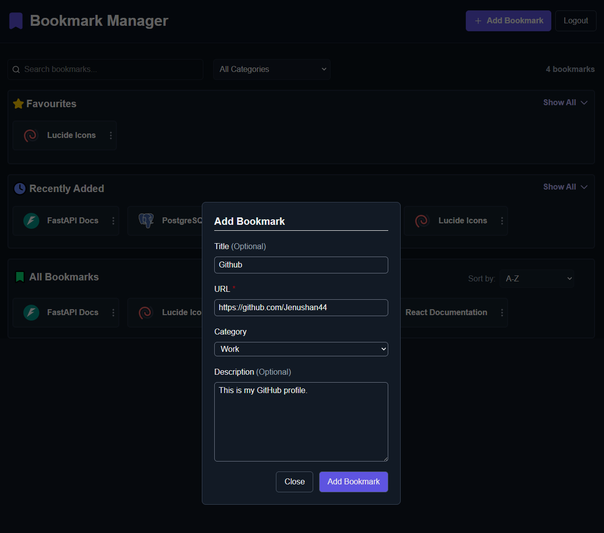
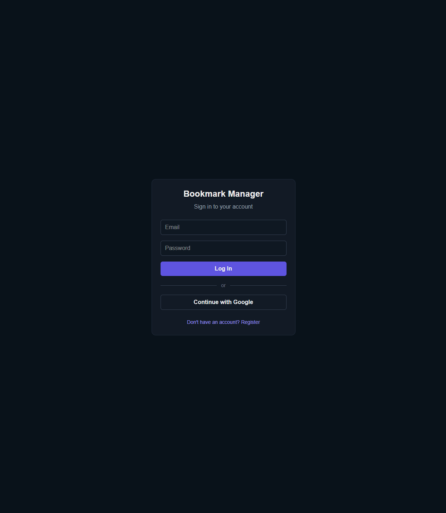

# Bookmark Manager

A full-stack web application for saving, organizing and managing bookmarks. Users can search, filter, sort, favourite and manage their saved links through a responsive dashboard.

Built with Next.js, FastAPI, PostgreSQL, and Firebase Authentication.

## Live Demo

Application: https://bookmark-manager-five-flax.vercel.app

API Documentation: https://bookmark-manager-p7pm.onrender.com/docs

## Screenshots

### Dashboard



### Bookmark Details



### Add Bookmark



### Login



## Features

- Create, view, edit and delete bookmarks
- Search bookmarks by title
- Filter bookmarks by category
- Sort bookmarks alphabetically or by date
- Mark bookmarks as favourites
- View recently added bookmarks
- Sign in with email/password or Google
- Each user has their own bookmarks
- Persistent bookmark storage with PostgreSQL
- Responsive bookmark layout

## Tech Stack

**Frontend**
- Next.js
- React
- TypeScript
- Tailwind CSS
- Lucide React

**Backend**
- FastAPI
- Python
- SQLAlchemy
- Pydantic
- Firebase Admin SDK

**Database**
- PostgreSQL
- Neon

**Authentication**
- Firebase Authentication

**Deployment**
- Vercel - Frontend
- Render - Backend
- Neon - Database

## API

All bookmark endpoints require authentication.

| Method   | Endpoint                   | Description              |
| -------- | -------------------------- | ------------------------ |
| `POST`   | `/bookmarks`               | Create a bookmark        |
| `GET`    | `/bookmarks`               | Get the user's bookmarks |
| `GET`    | `/bookmarks/{bookmark_id}` | Get a bookmark by ID     |
| `PATCH`  | `/bookmarks/{bookmark_id}` | Update a bookmark        |
| `DELETE` | `/bookmarks/{bookmark_id}` | Delete a bookmark        |

## Project Structure

```text
bookmark-manager/
|
|-- backend/
|   |-- main.py
|   |-- database.py
|   |-- firebase_auth.py
|   |-- models.py
|   |-- schemas.py
|   |-- requirements.txt
|
|-- frontend/
|   |-- app/
|   |-- components/
|   |-- lib/
|   |   |-- firebase.ts
|   |-- package.json
|
|-- screenshots/
|   |-- dashboard.png
|   |-- bookmark-info.png
|   |-- add-bookmark.png
|   |-- login.png
|
|-- README.md
```

## Getting Started

### Backend

Move into the backend directory:

```bash
cd backend
```

Install dependencies:

```bash
pip install -r requirements.txt
```

Create a `.env` file and add your PostgreSQL connection:

```env
DATABASE_URL=your_postgresql_connection_string
```

Firebase Admin credentials are also required for authentication.

Start the backend:

```bash
uvicorn main:app --reload
```

The API will run at `http://127.0.0.1:8000`.

### Frontend

Move into the frontend directory:

```bash
cd frontend
```

Install dependencies:

```bash
npm install
```

Create a `.env.local` file:

```env
NEXT_PUBLIC_FIREBASE_API_KEY=
NEXT_PUBLIC_FIREBASE_AUTH_DOMAIN=
NEXT_PUBLIC_FIREBASE_PROJECT_ID=
NEXT_PUBLIC_FIREBASE_STORAGE_BUCKET=
NEXT_PUBLIC_FIREBASE_MESSAGING_SENDER_ID=
NEXT_PUBLIC_FIREBASE_APP_ID=
```

Start the frontend:

```bash
npm run dev
```

The application will run at `http://localhost:3000`.